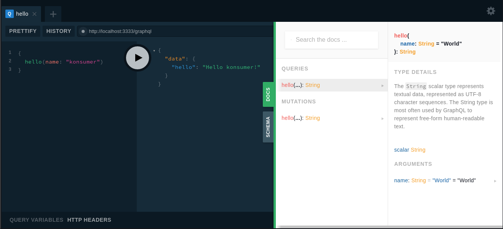

# minimal arc graphql example



```
npm i          # install tools & dependencies
npm start      # run local dev-server
npm run deploy # deploy on lambda
```

run `npm start` and visit the [playground](http://localhost:3333/graphql) to explore your server, with is implemented in [post-graphql](src/http/post-graphql).